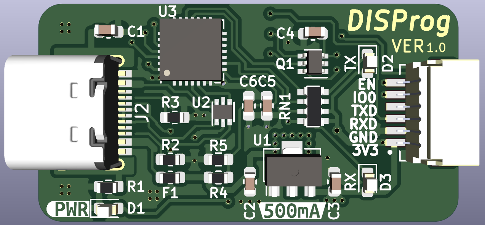

# DisProg™

Si estás interesado en adquirir uno de estos adaptadores preensamblados, te invito a visitar mi tienda en https://disgran.com

DisProg™ representa una placa de adaptador USB a serie que se fundamenta en el popular chip CP2102N, incluyendo un circuito de restablecimiento automático ESP32. A diferencia de los módulos económicos que puedes encontrar en Aliexpress, este adaptador destaca por su confiabilidad y versatilidad simultánea. Su confiabilidad se deriva del uso de un conocido chip de adaptador USB a serie proveniente de un proveedor reconocido, y su versatilidad radica en la inclusión del circuito de restablecimiento automático ESP32 IO & EN, eliminando la necesidad de implementarlo en la placa de destino.

Otro punto a favor de DisProg™ es su regulador de voltaje integrado de 3.3V y 500mA, capaz de alimentar el dispositivo que estás programando. Como opción adicional, puedes conectar un cable JST personalizado que facilita la programación segura de relés Shelly sin depender de la alimentación principal. Esto sitúa a DisProg™ como uno de los mejores adaptadores USB/serie para cargar el firmware de tus dispositivos con Tasmota o ESPHome.

Para obtener más detalles sobre este proyecto, te invito a consultar la entrada correspondiente en https://disgran.com/disprog.

